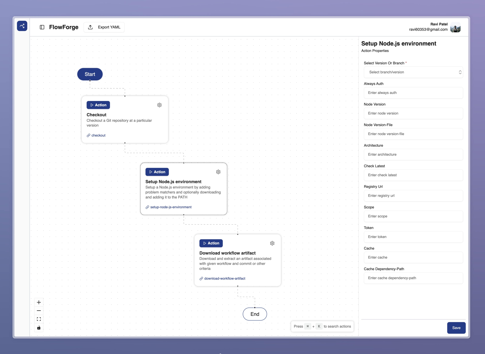

# FlowForge 🚀

_Craft Your GitHub Workflows with Ease and Fun!_

**Description**:

FlowForge is your interactive sidekick for building and managing GitHub workflows effortlessly. With a playful drag-and-drop interface, it transforms complex automation into a delightful experience.

**Features**:

- **🎨 Visual Workflow Builder**: Design workflows with an intuitive drag-and-drop interface—no coding required!
- **🔧 Custom Node Integration**: Add personalized nodes to tailor workflows to your unique needs.
- **✅ Real-time Validation**: Get instant feedback to ensure your workflows are error-free before deployment.
- **🔗 Seamless GitHub Integration**: Connect directly to your GitHub repositories for smooth workflow management.

**Tech Stack**:

- **Next.js**: React framework for server-side rendering.
- **Tailwind CSS**: Utility-first CSS framework for rapid UI development.
- **Shadcn/UI**: Reusable components built with Radix UI and Tailwind CSS.
- **Drizzle ORM**: TypeScript-first ORM for Node.js.
- **React Flow**: Library for building node-based interfaces.
- **Zustand**: Fast and scalable state management for React.

**Getting Started**:

1. **Clone the Repository**:

   ```bash
   git clone https://github.com/cybertron288/flowforge.git
   ```

2. **Navigate to the Project Directory**:

   ```bash
   cd flowforge
   ```

3. **Install Dependencies**:

   ```bash
   yarn install
   ```

   If you're using npm, run `npm install`.

4. **Set Up Environment Variables:**

   Duplicate the .env.example file and rename it to .env.local.

   Update the environment variables in .env.local as needed.

5. **Run Database Migrations:**

   ```bash
   npx drizzle-kit migrate
   ```

6. **Start the Development Server:**

   ```bash
   yarn dev
   ```

   Open http://localhost:3000 in your browser to access the application.
